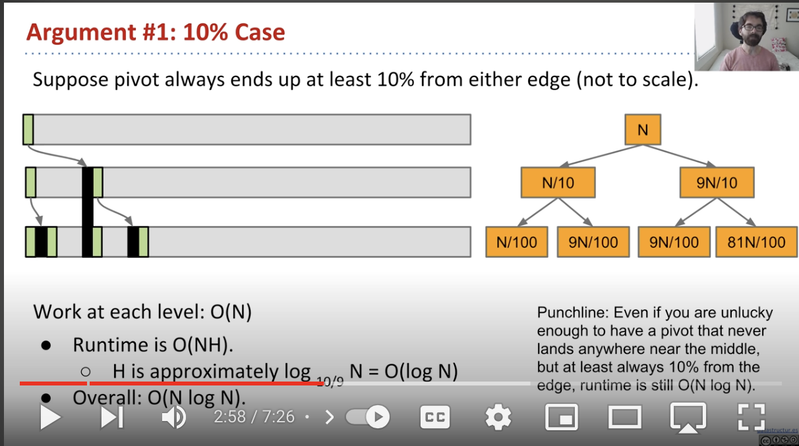

# Stability in sorting algorithms ("Is Quicksort stable?")
## [Sorting Algorithm Stability](https://en.wikipedia.org/wiki/Sorting_algorithm#Stability)
-  If two items compare as equal (like the two 5 cards), then their relative order will be preserved, i.e. if one comes before the other in the input, it will come before the other in the output.
- Unstable sorting algorithms can be specially implemented to be stable. One way of doing this is to artificially extend the key comparison, so that comparisons between two objects with otherwise equal keys are decided using the order of the entries in the original input list as a tie-breaker. Remembering this order, however, may require additional time and space.
## [Stability In Sorting Algorithms](http://stackoverflow.com/questions/1517793/stability-in-sorting-algorithms)

A sorting algorithm is said to be stable if two objects with equal keys appear in the same order in sorted output as they appear in the input array to be sorted. Some sorting algorithms are stable by nature like Insertion sort, Merge Sort, Bubble Sort, etc. And some sorting algorithms are not, like Heap Sort, Quick Sort, etc.

Background: a "stable" sorting algorithm keeps the items with the same sorting key in order. Suppose we have a list of 5-letter words:

```
peach
straw
apple
spork
```
If we sort the list by just the first letter of each word then a stable-sort would produce:
```
apple
peach
straw
spork
```
In an unstable sort algorithm, straw or spork may be interchanged, but in a stable one, they stay in the same relative positions (that is, since straw appears before spork in the input, it also appears before spork in the output).

We could sort the list of words using this algorithm: stable sorting by column 5, then 4, then 3, then 2, then 1. In the end, it will be correctly sorted. Convince yourself of that. (by the way, that algorithm is called radix sort)

Now to answer your question, suppose we have a list of first and last names. We are asked to sort "by last name, then by first". We could first sort (stable or unstable) by the first name, then stable sort by the last name. After these sorts, the list is primarily sorted by the last name. However, where last names are the same, the first names are sorted.

You can't stack unstable sorts in the same fashion.

## [Stability In Sorting Algorithms](http://www.geeksforgeeks.org/stability-in-sorting-algorithms/)

### Do we care for simple arrays like the array of integers? 
When equal elements are indistinguishable, such as with integers, or more generally, any data where the entire element is the key, stability is not an issue. Stability is also not an issue if all keys are different.

### Can we make any sorting algorithm stable? 
Any given sorting algorithm which is not stable can be modified to be stable. There can be algorithm-specific ways to make it stable, but in general, any comparison-based sorting algorithm which is not stable by nature can be modified to be stable by changing the key comparison operation so that the comparison of two keys considers position as a factor for objects with equal keys.

## [Sorting Algorithms - Stability](http://homepages.math.uic.edu/~leon/cs-mcs401-s08/handouts/stability.pdf)
Unfortunately, many of the (otherwise) best sorting algorithms are
not stable.
    - For example, quicksort and heapsort are not stable. (Mergesort
property implemented is stable.)

Any sorting algorithm may be made stable, at a price: The price is
Θ(n) extra space, and moderately increased running time (less than
doubled, most likely).
    - We have to (temporarily) append a sequence number to the key of
each element of the array. The sequence number serves as a tie-
breaker.

# Mergesort
## [Merge Sort In Python Explained (with example and code)](https://www.youtube.com/watch?v=cVZMah9kEjI)
### Overview
Divide and conquer algorithm
    - A problem is divided into subproblems recursively until the problem is very simple to solve
    - Solutions are combined to solve original problem

### General Principle
Merge Sort:
    1. Divide array in two halves
    2. Recursively sort each half
    3. Merge two halves

Example:
- Sort:
    - `[2, 6, 5, 1, 7, 4, 3]`
    - `[2, 6, 5, 1] [7, 4, 3]`
    - `[2, 6, 5, 1] [7, 4, 3]`
    - `[2, 6] [5, 1] [7, 4] [3]`
    - `[2] [6] [5] [1] [7] [4] [3]` # sorted
- Now merge:
    - `[2] [6]` => `[2, 6]`
    - `[5] [1]` => `[1, 5]`
    - `[7] [4]` => `[4, 7]`
    - `[3]`
    - `[2, 6] [1, 5]` => `[1, 2, 5, 6]`
    - `[4, 7] [3]` => `[3, 4, 7]`
    - `[1, 2, 5, 6] [3, 4, 7]` => `[1, 2, 3, 4, 5, 6, 7]`

```python
Num = Union[int, float]

def mergesort(nums: List[Num], left: int = 0, right: int = None) -> None:
    """
    Sort a list of numbers in place

    Parameters
    ----------
    nums: List[Num]

    Returns
    -------
    None
    """
    if right is None:
        right = len(nums)-1

    if left >= right:
        return
    
    mid = (left+right)//2

    # recursion
    mergesort(nums, left, mid)
    mergesort(nums, mid+1, right)

    merge(nums, left, right, mid)
    
def merge(nums: List[Num], left: int, right: int, mid: int) -> None:
    """
    Merge two lists in sorted order

    Parameters
    ----------
    nums: List[Num]
        List of numbers to be merged
    left: int
        Left bound index of nums
    right: int
        Right boudn index of nums
    mid: int
        Midpoint index of nums

    Returns
    -------
    None
    """
    # merge
    l_copy = nums[left:mid+1]
    r_copy = nums[mid+1:right+1]

    l_counter, r_counter = 0, 0
    k = left # sorted counter

    while l_counter<len(l_copy) and r_counter<len(r_copy):
        if l_copy[l_counter] <= r_copy[r_counter]:
            nums[k] = l_copy[l_counter]
            l_counter+=1
        else:
            nums[k] = r_copy[r_counter]
            r_counter+=1
        k+=1

    while l_counter<len(l_copy):
        nums[k] = l_copy[l_counter]
        l_counter+=1
        k+=1
    while r_counter<len(r_copy):
        nums[k] = r_copy[r_counter]
        r_counter+=1
        k+=1
```

#### Callstack
```
mergesort([7,5,2,1,3]) 
	mergesort([7,5])				// left 
		mergesort([7])			// left 
			return [7] 
		mergesort([5])			// right 
			return [5] 
		return merge([7],[5])		// returns [5, 7] 
	mergesort([2,1,3])			// right 
		mergesort([2])			// left 
			return [2] 
		mergesort([1,3])			// right 
			mergesort([1])  		// left	 
				return [1] 
			mergesort([3])		// right 
				return [3] 
			return merge([1],[3])	// returns [1, 3] 
		return merge([2], [1,3])		// returns [1,2,3] 
	return merge([5,7], [1,2,3])		// returns [1,2,3,5,7] 
```
### Runtime (Best and Wost Case are the same!)
- $\Theta$(n*log(n))
    - Optimal runtime for comparison based algorithms

## [1. Mergesort](https://www.coursera.org/lecture/algorithms-part1/mergesort-ARWDq)
Steps:
1. Divide array in two halves
2. Recursively sort each half
3. Merge two halves

Idea is based on the idea of merging

# Quicksort

## [Quicksort in 4 minutes](https://www.youtube.com/watch?v=Hoixgm4-P4M)
### Recursive algorithm
- Think pivot
- A pivot is one of the items in the array that meets the following 3 conditions after we sorted it
    1. Correct final position in sorted array
    2. Items to the left are smaller
    3. Items to the right are larger
    - Example: `[ 2 6 5 3 8 7 1 0]`
        - First, move the pivot to the end to get it oput of the way `[2 6 5 0 8 7 1 3]`
        - Look for first instance of (both) thesetwo items
            - itemFromLeft: first item starting from the left that is larger than pivot
            - itemFromRight: first item starting from the right that is less than pivot
        - `6` is itemFromLeft and `1` is item from right. Swap them
            - => `[2 1 5 0 8 7 6 3]`
        - Now, `5` is itemFromLeft and `0` is item from right. Swap them
            - => `[2 1 0 5 8 7 6 3]`
        - Now itemFromLeft has a greater index than itemFromRight so we know we are done
        - Now simply swap itemFromLeft with our pivot
            - => `[2 1 0 3 8 7 6 5]` and now our pivot is in the right spot! And we now have 2 partitions (everything left of 3 and everything right of 3)
        - So now we recursively do the same thing on the two partitions
### How to choose pivot? 
-The pivot makes a big difference in the performance of the algorithm
- One popular method is `Median of 3`:
    - In this method we look at the first middle and last element of the array
    - we sort them and use the middle element as the pivot
        - We are making the guess that the middle of these 3 items could be close to the median of the array
        
### Time complexity:
- Worst case: O(n^2)
    - When does worst case happen?
- Average case: O(nlog(n))

#### Best Case
- If the pivot always lands in the middle, then we end up with 2 subproblems that are roughly half the size of the original problem
    - If the pivots of those are roughly at the middle, then you end up with 4 subproblems with roughly a quarter of the size of the original problem 
    - and so on..
- In this case, the problem breaks down in to a tree of `logn` depth
- Work done at each level:
    - Level 0: `n` work
    - Level 1: `n/2` work each partition so `2 * n/2 ~ n`
    - Level 3: `n/4' at each partition so `4 * n/4 ~ n`
    - And so on...
    - So at each level we have roughly `n` amount of work
- Therefore best case time complexity is $\Omega$(nlog(n))

#### Worst Case
Pivot lands always at the beginning of the array
- This means the first problem is divided into a 2 subproblems where the left is size 1 and the right is n-1
- At each subsequent level, the problem will be subdivided into 1+d and n-d where d is the depth of the callstack; therefore we will have n subproblems all which take n-d time
- Worst case is $\Theta$(n^2)

#### Average Case
Runtime complexity: $\Theta$(nlog(n))
Proof:


##### Despite this Worst Case, quicksort is actually better than mergesort

## [Sorting 2, Video 4 Quicksort Best and Worst Case](https://www.youtube.com/watch?v=PJnHzFypGaI
)

## [1. Quicksort](https://www.coursera.org/lecture/algorithms-part1/quicksort-vjvnC)
- Recusrive algorithm 
- Like mergesort except that it does the recursion after it does the work, whereas mergesort does it before it does the work

Steps:
1. Shuffle the array
2. Partition so that for some j:
    - entry a[j] is in place
    - No larger entry to the left of j
    - No smaller entry to the right of j
3. Sort each piece recursively


# [Sedgewick - Quicksort (4 videos)](https://www.coursera.org/learn/algorithms-part1/home/week/3)
    - [ ] [1. Quicksort](https://www.coursera.org/lecture/algorithms-part1/quicksort-vjvnC)
    - [ ] [2. Selection](https://www.coursera.org/lecture/algorithms-part1/selection-UQxFT)
    - [ ] [3. Duplicate Keys](https://www.coursera.org/lecture/algorithms-part1/duplicate-keys-XvjPd)
    - [ ] [4. System Sorts](https://www.coursera.org/lecture/algorithms-part1/system-sorts-QBNZ7)

# UC Berkeley Sort Lectures: tAKE NOTES NEXT TIME
## [CS 61B Lecture 29: Sorting I (video)](https://archive.org/details/ucberkeley_webcast_EiUvYS2DT6I)
### Insertion Sort
#### Runs in O(n^2)
#### Procedure:
Maintain the invariant that S is sorted
- start with emopty list S and unsorted list i of N items
```python
for x in i:
    # insert x into S in sorted order
```

#### Notes:
Linked lST
- If S is a linked list, then O(n) worst-case time to find the right position to insert
Array
- If S is an array then we can use binary search to find the insertion position which becomes O(logn) to ***find*** the right position to insert **BUT** it doestake O(n) time to shift higher items over after inserting

In place Sort
- Insertion sort is in place sort if S is an Array
    - This is done by 'partitioning' the array into S and I in place with indexing
- Space complexity O(1)

Inversions:
- if you start with an already almost sorted array then running time is proportional to the numbher of inversions

Balanced Search Tree:
- If S is a balanced search tree then running time can become O(nlogn)
    - This is not used in practiced because there are better sorting algorithms for balanced search trees that run faster (still O(nlogn) but with better coefficients)

For implementation: see `code/insertionsort.py`

### Selection
#### Runs in O(n^2) ALWAYS
#### Procedure:
Maintain the invariant that S is sorted
- start with emopty list S and unsorted list i of N items
```
for (i=0;i<n;i++){
    x <- item in I with smallest key
    remove x from I
    append x to end of S
}
```
Whether S is array or linked list:
- $\Theta$(n^2)

In place sort:
- This algorithm can be done in place

### Heapsort
### Mergesort